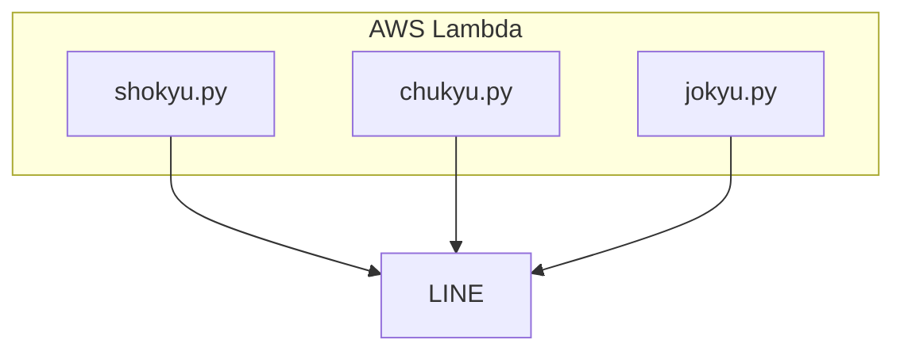

<p>


</p>

# lab-detection<!-- TODO 書く -->
LINE NotifyによりLINEにテキストや写真を通知するPythonコードです。
AWSのLambdaへの実装を想定しています。

# DEMO


# Features
<!-- By specifying the ID on Google Drive, the photos will be overwritten. This ensures there is no worry about consuming too much storage space.

Google Drive上のidを指定することで写真を上書きします。容量を圧迫する心配がないです。 -->

# Requirement
* Python 3.12
* requests (chukyu.py)
* BeautifulSoup4 (jokyu.py)

# Installation
pipコマンドでrequests、BeautifulSoup4をインストールしてください。
Lambda関数として利用する場合はzipファイルとしてライブラリをインポートしてください

```bash
pip install requests # chukyu.py
pip install beautifulsoup4 # jokyu.py

pip install python-dotenv # Lambda以外で利用する場合
```

# Usage
リポジトリをクローンし、.envファイルを作成、トークンを記載しディレクトリ内にある任意のPythonコードを実行してください。


```bash
git clone https://github.com/daikidaiku/upload-lab-photo
cd upload-lab-photo
python3 main.py
``` 

.envファイル内は以下のように記載してください。
```bash
TOKEN='取得したアクセストークン'
```

# Note
LINE Notifyのトークン取得方法は以下の記事をご覧ください。

【Python】LINE Notifyの手引き #LineNotify - Qiita

<https://qiita.com/daikidaiku/items/4c364b393d4af16ac283>

# Author

* daiki_daiku
* Waseda University
* Twitter : https://twitter.com/daiki_da1ku

# License

lambda-line-notify is under [MIT license](https://en.wikipedia.org/wiki/MIT_License).